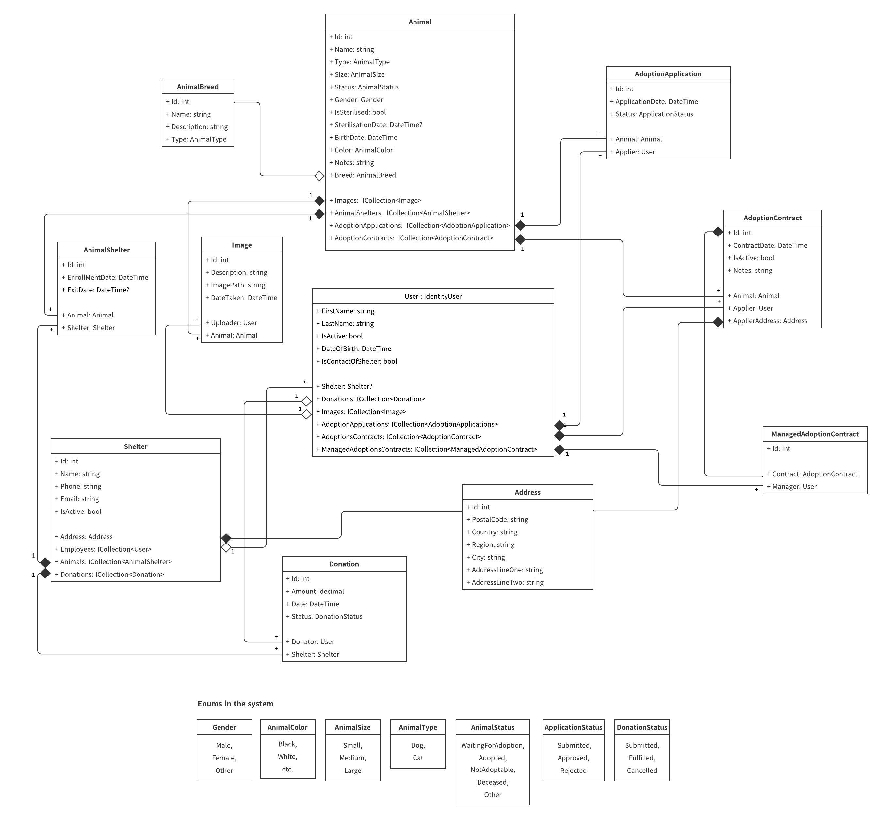

# Animal Adoption Management System - Backend 

####  For the frontend, please visit [this](https://github.com/timigyurina/animal_adoption_management_system_frontend) Github repository.  

#### *Please note that this is an ongoing pet project of mine, continuously growing and evolving and may not yet have all features fully implemented*  
 

## About :paw_prints:  
This is the backend of a complex system that aims to unify and centralise the management of animals living in shelters and looking for a possible adopter providing them a new home.
Unlike many others, this application not only stores data of a particular shelter. It was designed to store unrelated shelters from anywhere around the world, also different kinds of animals and different users, who are simply looking for adoptable animals or who work at the shelters that are stored in the system. Besides storing different entities, multiple endpoints for creating, updating and querying these entities are also provided.
Apart from browsing among adoptable animals, one of the main functionalities for possible adopters is the opportunity to create adoption applications. These can be later evaluated and either rejected or approved by the employee of the shelter at which the animal is currently residing. After the approval of an adoption application comes creating an adoption contract, which means the animal has been successfully adopted and is no longer residing at the shelter.  
 

## Main features and technologies :zap:  
- ASP .NET backend with different controllers and endpoints, using service interfaces for managing different entities (e.g Shelter, Animal, AdoptionApplication)
- Endpoints with paginated results
- Entity Framework as an ORM tool
- PostgreSQL database for storing data, entities with different kinds of relationships (often many-to-many) between them
- IdentityCore used for user authentication and authorization
- JWT token (and also refresh token) stored in http-only cookie for managing the authentication and authorization process
- Image uploading and storing
- Serilog, configured for logging useful information into text files (only used in some authentication-related parts of the application for demo purposes) 
- AutoMapper
- Seeded data with custom DataInititaliser class
- Exception middleware  
 

## Images
##### 1. UML diagram of the model classes

 

### Disclaimer
The idea of this project and the particular details are completely mine, any resemblance to an existing API or software is purely coincidental.
